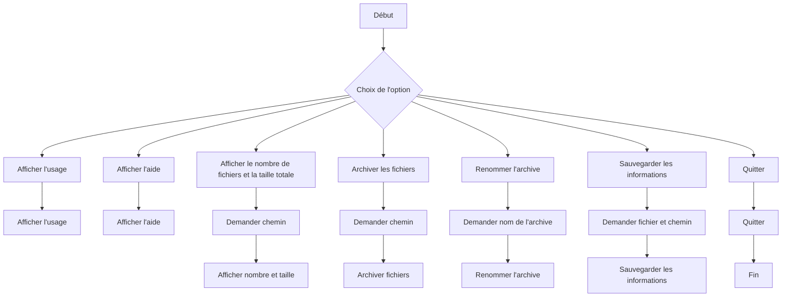
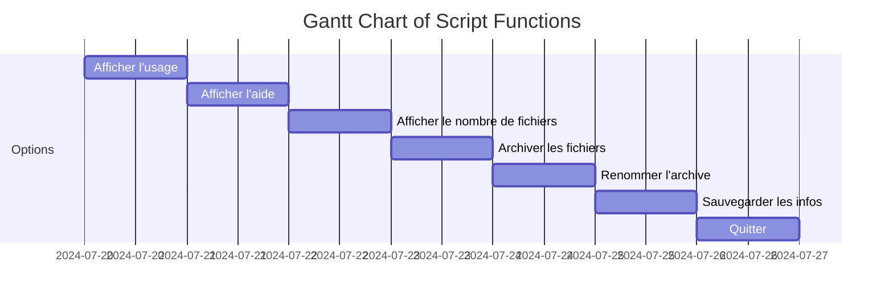

# Rapport du Script de Sauvegarde

Ce rapport explique le fonctionnement du script `sauvegarde.sh`, qui permet de gérer des fichiers en offrant plusieurs options à la fois en mode texte et en mode graphique.

## Vue d'ensemble

Le script est conçu pour :
- Afficher des informations d'utilisation
- Archiver des fichiers modifiés
- Renommer des archives
- Sauvegarder des informations sur les fichiers
- Fournir une interface graphique en plus de l'interface en ligne de commande

## Fonctionnalités

### 1. Afficher l'usage

```bash
show_usage() {
    echo "sauvegarde.sh: [-h] [-g] [-m] [-v] [-n] [-r] [-a] [-s] chemin.."
}
```

### 2. Afficher l'aide

```bash
HELP() {
    cat help.txt
}
```

### 3. Afficher le nombre de fichiers et la taille totale

```bash
afficher_nombre_taille() {
    local chemin="$1"
    find "$chemin" -type f -mtime -1 -exec ls -lh {} + | awk '{ print $9 ": " $5 }'
    find "$chemin" -type f -mtime -1 -exec du -ch {} + | grep total$
}
```

### 4. Archiver les fichiers

```bash
archiver_fichiers() {
    local chemin="$1"
    local archive_name="backup_$(date +%Y%m%d_%H%M%S).tar.gz"
    find "$chemin" -type f -mtime -1 -print0 | tar --null -czvf "$archive_name" --files-from -
    echo "Fichiers archivés dans $archive_name"
}
```

### 5. Renommer l'archive

```bash
renommer_archive() {
    local archive_name="$1"
    local new_archive_name="backup_$(date +%Y%m%d_%H%M%S)_modified.tar.gz"
    mv "$archive_name" "$new_archive_name"
    echo "Archive renommée en $new_archive_name"
}
```

### 6. Sauvegarder les informations

```bash
sauvegarder_infos() {
    local fichier="$1"
    local chemin="$2"
    find "$chemin" -type f -mtime -1 -exec ls -lh {} + >"$fichier"
    echo "Informations sauvegardées dans $fichier"
}
```

## Menus et Interfaces

### Menu Textuel

```bash
afficher_menu() {
    while true; do
        echo "Menu :"
        echo "1. Afficher l'usage"
        echo "2. Afficher l'aide"
        echo "3. Afficher le nombre de fichiers et la taille totale"
        echo "4. Archiver les fichiers"
        echo "5. Renommer l'archive"
        echo "6. Sauvegarder les informations"
        echo "7. Quitter"
        read -p "Choisissez une option : " choix
        case $choix in
        1) show_usage ;;
        2) HELP ;;
        3)
            read -p "Entrez le chemin : " chemin
            afficher_nombre_taille "$chemin"
            ;;
        4)
            read -p "Entrez le chemin : " chemin
            archiver_fichiers "$chemin"
            ;;
        5)
            read -p "Entrez le nom de l'archive : " archive_name
            renommer_archive "$archive_name"
            ;;
        6)
            read -p "Entrez le fichier de sauvegarde : " fichier
            read -p "Entrez le chemin : " chemin
            sauvegarder_infos "$fichier" "$chemin"
            ;;
        7) exit 0 ;;
        *) echo "Choix invalide" ;;
        esac
    done
}
```

### Menu Graphique

```bash
afficher_menu_graphique() {
    choix=$(yad --list --title "Sauvegarde" --text "Choisissez une option:" \
        --column "Option" \
        "Afficher l'usage" \
        "Afficher l'aide" \
        "Afficher le nombre de fichiers et la taille totale" \
        "Archiver les fichiers" \
        "Renommer l'archive" \
        "Sauvegarder les informations" \
        "Quitter" \
        --width 400 --height 300)
    
    option=$(echo "$choix" | cut -d'|' -f1)

    case "$option" in
        "Afficher l'usage") show_usage ;;
        "Afficher l'aide") HELP ;;
        "Afficher le nombre de fichiers et la taille totale") 
            chemin=$(yad --entry --title "Chemin" --text "Entrez le chemin :")
            afficher_nombre_taille "$chemin"
            ;;
        "Archiver les fichiers") 
            chemin=$(yad --entry --title "Chemin" --text "Entrez le chemin :")
            archiver_fichiers "$chemin"
            ;;
        "Renommer l'archive") 
            archive_name=$(yad --entry --title "Archive" --text "Entrez le nom de l'archive :")
            renommer_archive "$archive_name"
            ;;
        "Sauvegarder les informations") 
            fichier=$(yad --entry --title "Fichier de sauvegarde" --text "Entrez le fichier de sauvegarde :")
            chemin=$(yad --entry --title "Chemin" --text "Entrez le chemin :")
            sauvegarder_infos "$fichier" "$chemin"
            ;;
        "Quitter") exit 0 ;;
        "") yad --error --text "Aucune option sélectionnée" ;;
        *) yad --error --text "Choix invalide: $option" ;;
    esac
}
```

## Graphiques et Diagrammes

### Flux de Travail



### Diagramme de Processus



## Conclusion

Le script offre une solution flexible pour gérer les fichiers, avec une interface textuelle et graphique pour répondre aux différents besoins des utilisateurs. Les diagrammes ci-dessus montrent le flux de travail et les processus du script pour une meilleure compréhension.

---

**Remarque :** Pour utiliser l'interface graphique, assurez-vous que `yad` est installé sur votre système. Vous pouvez l'installer avec `sudo apt-get install yad` si ce n'est pas déjà fait.